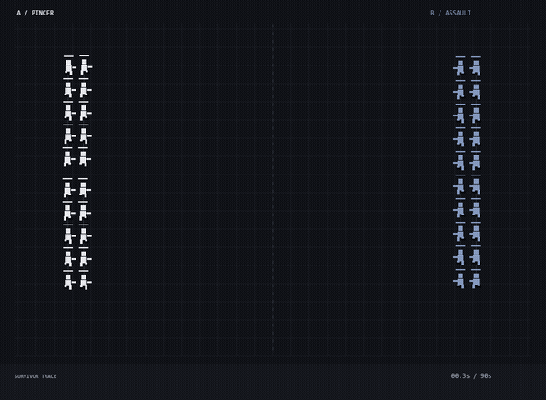

<p align="center"><sub>L / LABS — EXPERIMENT 001</sub></p>
<h1 align="center">Agent Arena</h1>
<p align="center">Two teams. Shared tactics. One field.</p>



**A playable, dependency-free tactical sandbox.** Change the seed, team size and opening tactics, then watch pixel agents coordinate, shoot and dodge. The monochrome interface belongs to [Lagerskoy's lab](https://github.com/Lagerskoy).

> This is a **rules-based simulation**, not an LLM benchmark. No model APIs are called. The winner emerges from seeded movement, firing and collision rules, not a comparison of real AI systems. Team names deliberately make no model-performance claims.

## Run it

1. Choose **Code → Download ZIP**, then extract the archive.
2. Open **index.html** in a modern desktop browser. No install, build, account or API key is needed.
3. Pick your options and press **New match**. Pause/resume and speed controls work during a run.

If your browser restricts local-file features, run `python -m http.server 8000` inside the extracted folder and open [localhost:8000](http://localhost:8000).

## What is inside

- 10, 20 or 30 agents per team, in five-person linked squads.
- **Pincer:** split the opening toward the top and bottom of the field.
- **Assault:** close distance faster and fire aggressively.
- **Guard:** prefer a longer engagement range.
- Projectile collisions, local threat-triggered dodges, separation and health.
- Survivor history and an event log driven by the same simulation state.
- Fixed 30 Hz simulation steps: speed controls affect playback, not the rules.
- **Export match JSON:** save configuration, agent state, history and the audit trail.
- **Record 15s WebM:** save the next 15 seconds of the canvas in Chrome/Edge. Keep the tab active; recording has no audio. Other browsers may not support recording.
- Reduced-motion preference starts the simulation paused.

## Preview & evidence

The GIF and [downloadable MP4](demo.mp4) render the actual application canvas at **3× simulation speed**, not a separate promotional animation. [preview.png](preview.png) is a still. [example-run.json](example-run.json) records the same seed-731 run. To reproduce a saved configuration, enter its seed, size and tactics and start a new match; JSON import is not implemented.

## Tests

With Node.js installed:

```sh
node test.cjs
```

Tests cover deterministic replay, all three tactics across all three team sizes, agent bounds, health, completion and rejected invalid settings. A match ends on elimination or after 90 simulation seconds; the team with more survivors wins, and equal survivor counts draw.

## Files

| File | Responsibility |
| --- | --- |
| `engine.js` | Seeded state, tactics, projectiles and results; runs in browser or Node |
| `app.js` | Canvas rendering, controls and exports |
| `index.html` / `style.css` | Accessible controls and responsive layout |
| `test.cjs` | Dependency-free engine tests |

## Limits

This is an illustrative sandbox: tactics are hand-written, squad links visualize membership rather than communication messages, collision handling is intentionally simple, and decisions are processed in agent order. It is **not** suitable for scientific ranking or fairness claims. No telemetry, external scripts or remote fonts are loaded.

---

[Ghost Office](https://github.com/Lagerskoy/ghost-office) · [Terminal Lab](https://github.com/Lagerskoy/terminal-lab) · [@lagerskoy](https://x.com/lagerskoy)
